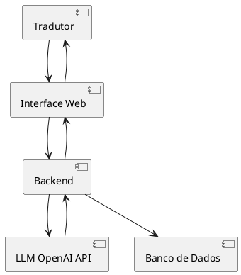

Para criar uma aplicação que utiliza modelos de linguagem para a tradução de livros e que atende ao objetivo de otimizar o trabalho de profissionais de tradução sem comprometer a qualidade, vamos estruturar um plano em várias etapas, cobrindo desde os requisitos até a implementação. Abaixo está um esboço inicial do projeto.

### Etapa 1: **Introdução**

#### Objetivo do Projeto
Criar uma aplicação que utiliza modelos de linguagem (LLM) para ajudar profissionais de tradução a:
- Otimizar o tempo de produção.
- Manter a qualidade da tradução.
- Personalizar as traduções de acordo com o estilo do tradutor.
- Oferecer suporte a múltiplos idiomas, com foco inicial em inglês para português.

#### Público-Alvo
Tradutores profissionais que desejam um auxílio tecnológico para aumentar a eficiência e a precisão de suas traduções.

---

### Etapa 2: **Levantamento de Requisitos**

#### Requisitos Funcionais
1. Tradução de textos de livros do inglês para o português com alta precisão.
2. Possibilidade de ajustar o estilo de tradução para replicar as preferências do tradutor.
3. Suporte para múltiplos pares de idiomas no futuro.
4. Interface para revisão e edição manual da tradução.
5. Sistema de aprendizado contínuo para melhorar o estilo e a precisão com base no feedback do tradutor.

#### Requisitos Não Funcionais
1. Alto desempenho na tradução de textos longos.
2. Segurança e privacidade dos dados (manter o texto do livro seguro).
3. Integração com ferramentas de edição de texto.
4. Escalabilidade para lidar com volumes maiores de texto.

#### Restrições
1. Uso de LLM da OpenAI como base para tradução.
2. Interface inicial simples, mas extensível para futuras funcionalidades.
3. Suporte à integração com ferramentas como CAT Tools (Computer-Assisted Translation).

---

### Etapa 3: **Arquitetura do Sistema**

#### Componentes Principais
1. **Frontend**: Interface para o tradutor interagir com o sistema.
2. **Backend**: Servidor responsável por processar as requisições de tradução e gerenciar dados.
3. **Serviços de Tradução**: Módulo que utiliza a API do LLM da OpenAI para realizar traduções.
4. **Banco de Dados**: Armazenamento de traduções, preferências do tradutor e histórico.
5. **Módulo de Aprendizado Contínuo**: Ajusta o estilo de tradução com base no feedback do usuário.

#### Fluxo Básico
1. O usuário carrega o texto do livro.
2. O texto é dividido em trechos e enviado para o LLM.
3. O sistema aplica as preferências do tradutor para ajustar o estilo.
4. As traduções são apresentadas em uma interface para revisão.
5. Feedback é armazenado e usado para melhorar o modelo.

---

### Etapa 4: **Plano de Implementação**

#### Linguagens e Tecnologias
- **Frontend**: React ou Vue.js.
- **Backend**: Node.js ou Python (com FastAPI ou Flask).
- **Banco de Dados**: PostgreSQL ou MongoDB.
- **Serviços de Tradução**: OpenAI GPT API (modelos como GPT-4 ou outros especializados em tradução).
- **Integração com Ferramentas**: JSON e APIs RESTful.

#### Passos
1. **Fase Inicial**
   - Configurar o ambiente de desenvolvimento.
   - Criar um MVP que realiza traduções simples.
2. **Adição de Personalização**
   - Implementar parâmetros ajustáveis para replicar o estilo do tradutor.
3. **Interface de Revisão**
   - Desenvolver uma interface amigável para que tradutores revisem e ajustem as traduções.
4. **Módulo de Aprendizado**
   - Incorporar feedback para ajustar futuras traduções.
5. **Suporte Multilíngue**
   - Expandir o sistema para suportar outros pares de idiomas.

---

### Etapa 5: **Sistema de Aprendizado Contínuo**

O módulo de aprendizado contínuo pode ser implementado usando:
1. **Feedback Explícito**: O tradutor marca se uma tradução está adequada ou precisa de ajustes.
2. **Exemplo Baseado em Edição**: O sistema analisa as edições feitas pelo tradutor e ajusta seu modelo.

#### Estrutura do Feedback
- **Parâmetros Ajustáveis**: Formalidade, estilo literário, fluidez, etc.
- **Histórico de Traduções**: Salvar versões anteriores para análise e auditoria.

---

### Etapa 6: **Exemplo de Arquitetura (Diagrama)**

---

### Etapa 7: **Considerações Finais**

1. **Validação Contínua**: Testar com tradutores profissionais durante o desenvolvimento.
2. **Foco na Qualidade**: Garantir que o modelo produza traduções que precisem de pouca revisão.
3. **Segurança**: Implementar criptografia para proteger o conteúdo dos livros.

---
